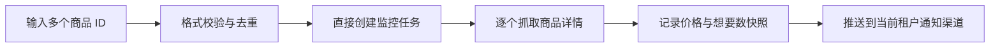
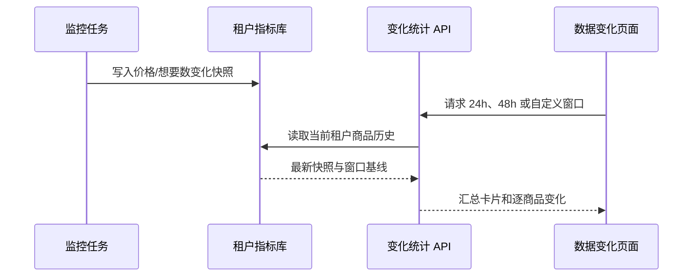

# 商品监控系统用户指南

## 1. 功能范围

系统只使用本地规则和指定商品 ID 进行监控，不需要配置模型或提示词。每个租户拥有独立的任务、账号、结果、指标历史和通知配置。

## 2. 创建监控

### 关键词监控

1. 进入“任务管理”，点击“创建新任务”。
2. 选择“关键词监控”，填写任务名称和闲鱼搜索词。
3. 可填写多条匹配关键词；留空时自动使用搜索词。
4. 设置价格、地区、发布时间、账号和 Cron 后保存。

只有命中任一规则的商品才会推送到当前租户配置的通知渠道。

### 商品 ID 批量监控

1. 选择“商品 ID 监控”。
2. 粘贴一个或多个数字 ID，可用换行、空格、中英文逗号分隔。
3. 系统自动去重并一次保存全部 ID，不会进入任务生成流程。
4. 成功获取指定商品详情后会直接记录指标并通知。



## 3. 查看 24/48 小时变化

进入侧边栏“数据变化”：

- 默认窗口为 1、3、6、12、24、48、72 小时。
- 可添加 1-720 小时的整数窗口，最多同时查看 8 个。
- 可按任务筛选，或搜索商品标题和商品 ID。
- 卡片展示窗口内想要数总变化、价格总变化和跟踪商品数。
- 表格展示每个商品的当前值、窗口变化量和更新时间。

变化量计算方式：

```text
变化量 = 当前租户内该商品的最新快照 - 时间窗口起点的历史快照
```

若商品历史不足所选窗口，系统使用当前可用的最早快照作为基线。只有价格或想要数发生变化时才新增快照，因此页面反映的是有效变化点。



## 4. 租户隔离

登录令牌决定租户上下文，前端不能通过请求参数切换租户。任务进程、SQLite 数据库、登录态、日志和通知配置均按租户分区；“数据变化”接口也只查询当前登录租户的指标库。

## 5. 常见问题

- 页面没有变化数据：先运行一次任务；同一商品至少出现两个不同的价格或想要数快照后才会显示非零变化。
- 商品 ID 报格式错误：只粘贴链接中的纯数字 ID，不要粘贴完整链接。
- 没有收到飞书通知：进入“系统设置 → 通知设置”检查当前租户的飞书 Webhook 并发送测试消息。
- 24 小时与 48 小时结果相同：通常表示商品在更早时段没有额外变化，或历史数据尚不足 48 小时。
