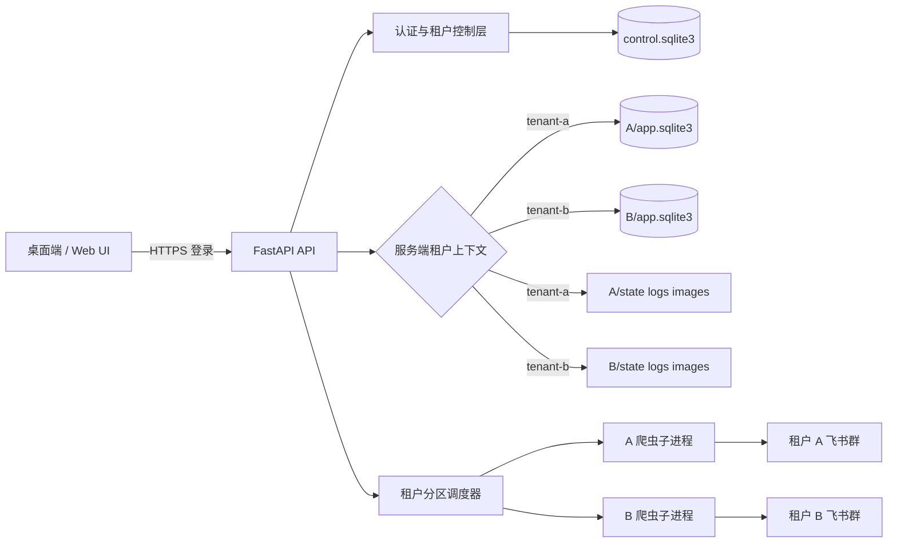
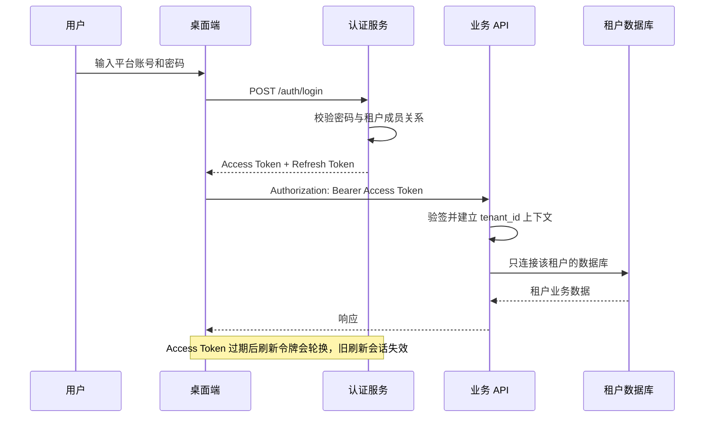
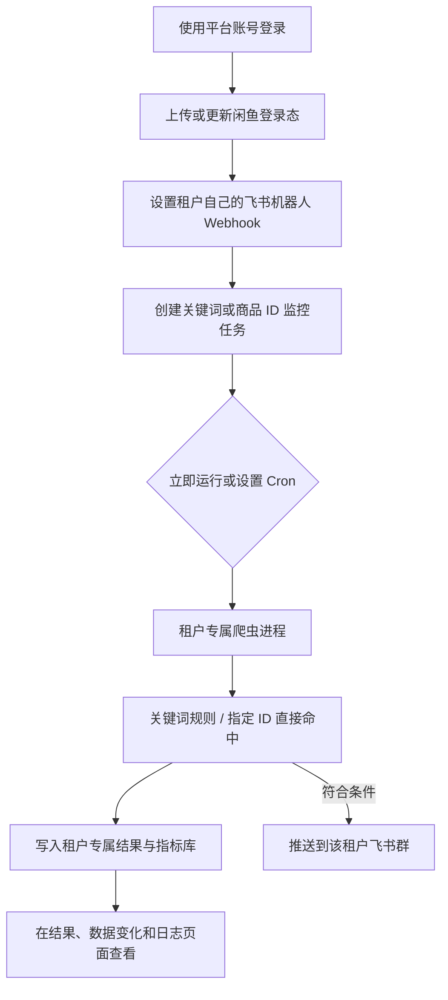

# 闲鱼监控多租户系统使用与部署指南

## 1. 系统定位

本系统采用“统一认证、租户级独立数据空间”的多租户模式。用户使用平台账号登录后，服务端从签名 Token 确定租户，客户端不能通过修改请求参数切换租户。

每个租户独立拥有：

- SQLite 业务数据库；
- 闲鱼登录态与账号文件；
- 任务日志、图片、结果兼容文件和价格历史；
- 飞书 Webhook 与代理配置；
- 调度任务命名空间和爬虫运行时。

平台控制库只保存用户、租户、成员关系和刷新会话，不保存业务监控结果。

## 2. 总体架构



## 3. 登录与鉴权流程



## 4. 服务器首次部署

### 4.1 准备配置

```bash
cp .env.example .env
```

生产环境至少修改：

```dotenv
WEB_USERNAME=platform-admin
WEB_PASSWORD=一段高强度初始管理员密码
AUTH_SECRET_KEY=至少32字符且随机生成的服务端签名密钥
DEFAULT_TENANT_ID=default
DEFAULT_TENANT_NAME=内部运营空间
RUN_HEADLESS=true
```

不要将 `.env`、Cookie 或真实飞书 Webhook 提交到 Git。

### 4.2 启动

```bash
docker compose up --build -d
docker compose logs -f app
curl http://127.0.0.1:8000/health
```

公网部署必须由 Nginx/Caddy 等反向代理提供 HTTPS。只向反向代理开放应用端口，并在防火墙中禁止公网直接访问 8000。

### 4.3 创建客户租户

推荐使用安全交互输入密码：

```bash
docker compose exec app python -m src.cli.create_tenant \
  --tenant-id customer-a \
  --tenant-name "客户 A" \
  --username customer-a-owner
```

也可以由平台管理员调用：

```http
POST /api/admin/tenants
Authorization: Bearer <平台管理员 Access Token>

{
  "tenant_id": "customer-a",
  "tenant_name": "客户 A",
  "username": "customer-a-owner",
  "password": "高强度初始密码"
}
```

## 5. 客户使用流程



### 5.1 登录闲鱼账号

1. 登录平台后进入“账号管理”。
2. 创建账号名称，例如 `primary`。
3. 上传有效的闲鱼状态 JSON。
4. 创建任务时选择固定账号、自动选择或轮换模式。

闲鱼状态属于敏感凭据，只能提供给可信租户管理员。不要通过聊天工具明文传播。

### 5.2 绑定飞书群

1. 在目标飞书群添加“自定义机器人”。
2. 复制机器人 Webhook。
3. 打开“系统设置 → 通知设置”。
4. 填入 Webhook 并执行测试通知。
5. 测试成功后保存。

Webhook 保存到当前租户的 `.env`，其他租户无法通过 API 读取或覆盖；接口响应只返回“是否已设置”，不会回显密钥。

### 5.3 创建监控任务

- 关键词模式适合明确规则和低成本筛选。
- 商品 ID 模式支持一次输入多个 ID，适合直接追踪指定商品的价格和想要数。
- “数据变化”页面支持 24/48 小时、预设窗口和 1-720 小时自定义窗口。
- Cron 决定自动执行周期；不要为大量任务设置过高频率。

任务执行时，服务端把 `TENANT_ID`、租户数据库路径和租户配置注入子进程。即使不同租户都存在任务 ID `0`，运行时键也分别是 `(tenant-a, 0)` 和 `(tenant-b, 0)`。

## 6. 数据目录与备份

```text
data/
├── control.sqlite3
├── auth_secret.key
└── tenants/
    ├── customer-a/
    │   ├── .env
    │   ├── data/app.sqlite3
    │   ├── state/
    │   ├── logs/
    │   ├── images/
    │   └── price_history/
    └── customer-b/
        └── ...
```

备份必须同时包含 `control.sqlite3`、`auth_secret.key` 和整个 `data/tenants/`。恢复时保持原目录权限，并在应用停止或使用 SQLite 在线备份机制时复制数据库，避免直接复制正在写入的 WAL 文件造成不一致。

## 7. 发布前检查

```bash
python3 -m pytest tests/integration/test_multitenant_isolation.py
python3 -m pytest
cd web-ui && npm ci && npm run build
docker compose build
docker compose up -d
docker compose logs --tail=200 app
```

至少人工验证：

1. A、B 两个租户分别登录。
2. 两边创建同 ID、不同名称的任务。
3. A 看不到 B 的任务、结果、账号、日志和设置。
4. 未登录调用 `/api/tasks` 返回 401。
5. 修改客户端租户字段不能切换空间。
6. A、B 的测试通知到达不同飞书群。
7. Access Token 过期后可以刷新，退出后刷新令牌失效。

## 8. 运维与安全边界

- 当前是“独立数据库与目录”的强逻辑隔离，同一应用进程仍共享 CPU、内存和服务器出口 IP。
- 高价值租户如需进程级隔离，可进一步部署为每租户独立 Worker 容器，并设置 CPU/内存配额。
- 所有爬虫共享出口 IP 时仍共享闲鱼风控信誉；必要时为租户绑定独立代理。
- 定期轮换 `AUTH_SECRET_KEY` 需要让所有用户重新登录。
- 禁止使用默认 `admin/admin123` 上线。
- 定期检查磁盘配额、失败任务、Cookie 失效、飞书推送失败和 SQLite 备份可恢复性。

## 9. 桌面端

桌面启动器设置 `DESKTOP_SERVER_URL=https://你的域名` 后只连接服务器，不再在客户电脑启动 FastAPI：

```bash
DESKTOP_SERVER_URL=https://monitor.example.com python desktop_launcher.py
```

正式桌面封装应将 Refresh Token 存入操作系统钥匙串。当前 Web UI 使用浏览器存储维持会话，适合 HTTPS 下的受控环境，但发布原生桌面客户端时仍建议增加系统钥匙串集成。
